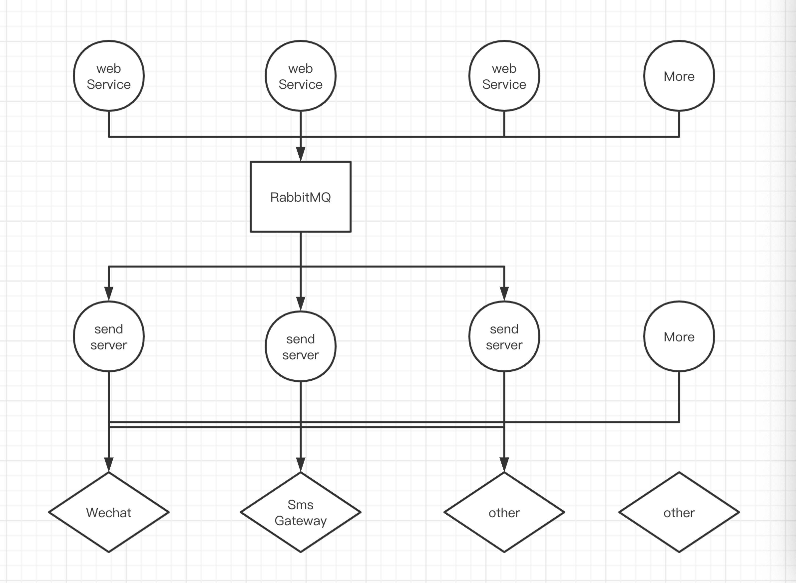

# 基于RabbitMQ的分布式推送服务

1. Python支持 `python3.8.5`, 依赖安装 `pip install -r requirement.txt`

2. 获取当前cpu核心数开启对应进程 `factory.py` > `create_process_pool`

3. 配置文件位置 `conf` > `dev.yaml`, 生产服务器名称 `factory.py` > `load_yaml_conf`

4. 运行 `python run_send_server.py`

## 服务相关支持

1. `redis` `mysql` 可以根据自己要求确定要不要

2. `mongodb` 支持请使用 `pip install motor`

3. `rabbitMQ` 若是太重可以改成别的mq, 当然也可以`redis list`

## 简单流程图

## 那就到这里了, 大家各凭本事
